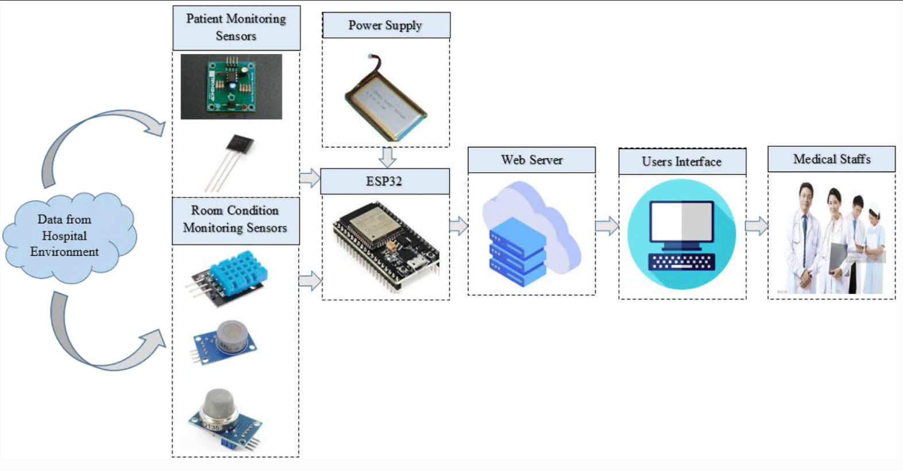

# Health-Monitoring-System

---

IoT based Health Monitoring System is a project for Hardware lab. This repository contains detailed description about the project and code also.

### Motivation

---

In this project, we tried to implement a cheap medium to monitor a patients’ condition continuously and provide information to doctors, nurses, and patient’s relatives efficiently. 

# Description

In this project, we implemented a microcontroller-based health monitoring system. It can continuously monitor patients’ health conditions such as body temperature, pulse and send this information to doctors and patient’s relatives’ phones. It will also automatically upload all information on the cloud through the WiFi module.

Overall system design is included here,

# Hardware

* Processors
  * ATmega32
  * Arduino-Uno (built-in ATmega328p)
  * ESP8266 WiFi Module
  * GSM Module (SIM800L)
* Sensors
  * Pulse Sensor
  * Body Temperature Sensor (LM35)
  * Room Temperature Sensor (DHT11)
* Others
  * BreadBoard
  * Battery
  * USB AVR ISP programmer
  * LCD Display
  * Resistor, Capacitor, and Inductor
  * Potentiometer
  * Jumper Wires

---

# Contribution

---

Want to contribute? 

Before contribution read [CONTRIBUTION.md](./CONTRIBUTION.md)

---

---
